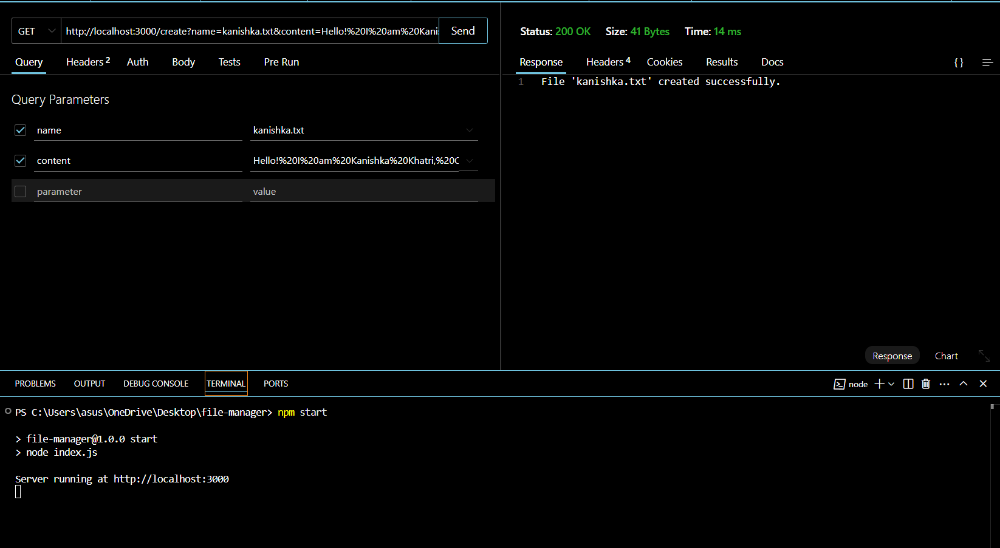
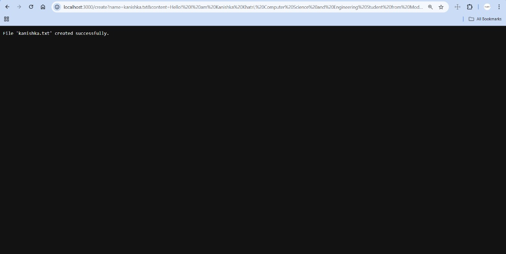
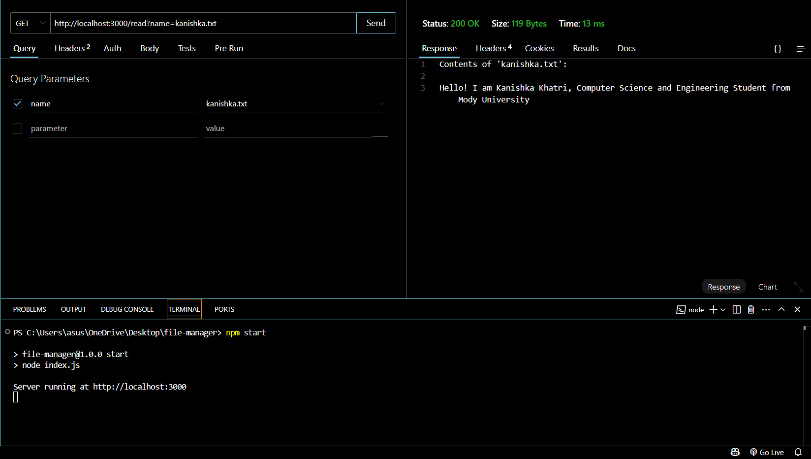
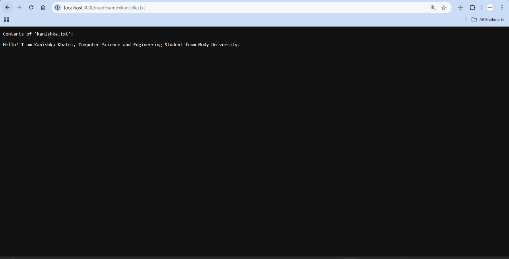
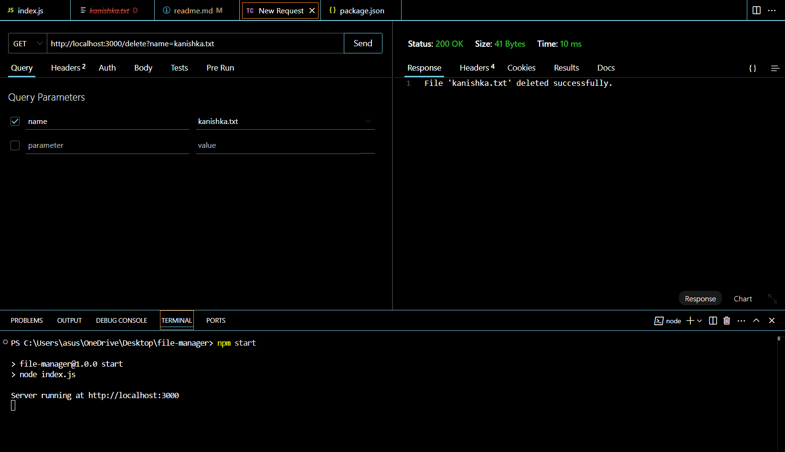
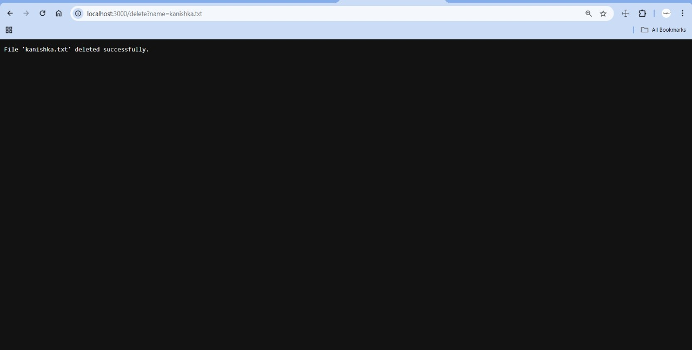

# 📁 Node.js File Manager Tool

This project is created as part of the **Celebal Summer Internship 2025 (Week 2 Assignment)**. It demonstrates how to build a simple file management tool using only **Node.js core modules** — no external libraries.

---

## 🚀 Features

- ✅ **Create** a new text file with custom content  
- 📖 **Read** the contents of an existing file  
- 🗑️ **Delete** a specific file from the system  
- 🧱 Built using Node.js **core modules**:
  - `fs` (File System)
  - `path`
  - `http`
  - `url`

---

## 📁 Project Structure

```
file-manager/
├── index.js             # Main server code
├── package.json         # Project metadata
├── README.md            # Project documentation
├── files/               # Directory to store user-generated files (auto-created)
└── Output/              # Folder containing screenshot images
```

---

## ⚙️ How to Run the Project

1. Clone the Repository

```bash
git clone https://github.com/kanishka-khatri/Celebal_Summer_Internship-2025.git
cd Celebal_Summer_Internship-2025
```

---

2. Install Node.js

If not already installed, download from:  
🔗 [https://nodejs.org/](https://nodejs.org/)

---

3. Start the Server

```bash
npm start
# or simply
node index.js
```

---

## 🌐 API Endpoints

- **Create a File**  
  `GET /create?name=yourfile.txt&content=yourcontent`

- **Read a File**  
  `GET /read?name=yourfile.txt`

- **Delete a File**  
  `GET /delete?name=yourfile.txt`

---

## 🧪 Example Demo

Use the following URLs to test the file manager locally after running the server:

### ✅ Create a File  
**Request:**  
`http://localhost:3000/create?name=kanishka.txt&content=Hello!%20I%20am%20Kanishka%20Khatri,%20Computer%20Science%20and%20Engineering%20Student%20from%20Mody%20University`  
**Thunder Client Response:**  
`File 'kanishka.txt' created successfully.`

### ✅ Read a File  
**Request:**  
`http://localhost:3000/read?name=kanishka.txt`  
**Thunder Client Response:**  
```
Contents of 'kanishka.txt':

Hello! I am Kanishka Khatri, Computer Science and Engineering Student from Mody University
```

### ✅ Delete a File  
**Request:**  
`http://localhost:3000/delete?name=kanishka.txt`  
**Thunder Client Response:**  
`File 'kanishka.txt' deleted successfully.`

---

## 🖼️ Screenshots

### 🔹 Create File (Thunder Client Request)


### 🔹 File Created (Browser Confirmation)


### 🔹 Read File (Thunder Client Request)


### 🔹 Read File Response (Browser Confirmation)


### 🔹 Delete File (Thunder Client Request)


### 🔹 Delete File Response (Browser Confirmation)


---

## 👩‍💻 Author

**Kanishka Khatri**  
B.Tech CSE, Mody University of Science and Technology  
🔗 [LinkedIn Profile](https://www.linkedin.com/in/kanishka-khatri/)

📌 *Submitted for Celebal Summer Internship 2025 – Week 2 Task*